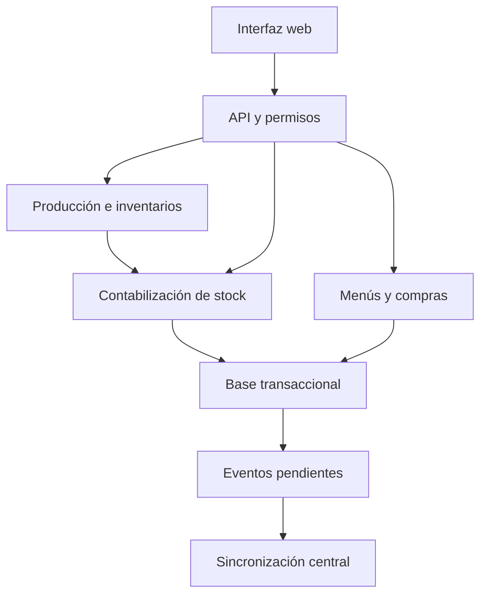

# Arquitectura, datos y límites de responsabilidad

## Punto de partida comprobado
Existe SQL SQLite con 59 tablas, cuatro vistas y triggers. Campos `_u6`: enteros escalados por 1 000 000. Campos `_bp`: puntos básicos, 4500 equivale a 45 %. El SQL no puede ejecutarse sin adaptación en PostgreSQL. La existencia de `sincronizacion_evento` e `integracion_envio` no implementa sincronización ni integración.

## Arquitectura propuesta, pendiente de adaptar al repositorio
Monolito modular: interfaz web → API → servicios de aplicación → dominio → repositorios/base. Módulos separados por responsabilidad, no microservicios iniciales. El único publicador de movimientos es el servicio de contabilización. Compras, producción e inventario invocan ese servicio por contratos internos, sin escribir saldos por su cuenta.

Seleccionar tecnologías en etapa 0 en función del código existente. Candidato de evaluación, no stack contratado: backend Python, interfaz TypeScript y base relacional. Las versiones concretas, bibliotecas y soporte se verifican con documentación oficial al implementarlas. No hay requisitos aquí de usar una versión “más reciente”.

## Despliegue sin conexión
Propuesta: un servidor de aplicación por sede, accesible por red local, es la autoridad de los movimientos de esa sede; la conexión a internet permite réplica central. Varias computadoras acceden al mismo servicio local, no comparten un archivo SQLite en una carpeta de red. Si se elige SQLite, limitar escritura mediante el servicio local y medir contención. Si se elige PostgreSQL, migrar y probar los controles equivalentes. No mantener dos motores por comodidad sin capacidad de probar ambos.

Una PWA por sí sola no garantiza disponibilidad offline multiusuario. Si cae la red local o el servidor de sede, el comportamiento debe estar definido: mostrar indisponibilidad, conservar borradores recuperables y evitar confirmar stock sin autoridad. No prometer edición offline independiente por dispositivo en la primera versión.

## Mapa del esquema existente
| Dominio | Tablas principales reales |
|---|---|
| Seguridad y sede | empresa, usuario, rol, permiso, rol_permiso, operacion, usuario_operacion_rol, almacen |
| Catálogo | unidad_medida, categoria_producto, producto_base, marca, variante_producto, empaque_compra |
| Abastecimiento | proveedor, proveedor_empaque, precio_compra, politica_abastecimiento |
| Menú | servicio, regimen, estructura_servicio, operacion_servicio, receta, receta_version, receta_ingrediente, ingrediente_variante_permitida, minuta, minuta_detalle, minuta_estructura_fija, costeo_ingrediente |
| Compras | prevision, prevision_detalle, pedido_compra, pedido_detalle |
| Recepción/stock | recepcion, recepcion_detalle, documento_stock, documento_stock_detalle, movimiento_stock, saldo_stock |
| Cocina | requerimiento, requerimiento_detalle, produccion, produccion_documento, merma_produccion |
| Inventario/cierre | inventario, inventario_detalle, inventario_ajuste, periodo_mensual, cierre_diario, cierre_validacion, ingreso_servicio |
| Extensiones | gasto, cliente, contrato, contrato_servicio, auditoria, sincronizacion_evento, integracion_envio |

## Integridad obligatoria
1. Claves compuestas empresa/ID o mecanismo equivalente que impida enlaces entre empresas. Autorización de lectura independiente de esas claves.
2. Unicidad empresa/código para catálogos y empresa/número para documentos. Numeración concurrente mediante secuencia segura; no `MAX+1` fuera de transacción.
3. Unidad y dimensión coherentes. No convertir masa a volumen con un factor genérico.
4. Factores, precios y contenidos usados quedan congelados en los documentos. Un cambio de envase crea versión o nueva presentación cuando afecta historia.
5. Un movimiento por línea contabilizada, con enlace al origen y reversión. Signo permitido por tipo, no solo valor ±1.
6. Saldo no negativo y conciliable con sumatoria de movimientos. El saldo es una proyección controlada, no un dato editable por operadores.
7. Fecha de negocio local separada de instante UTC de auditoría. La zona horaria de la operación determina el día cerrado; no usar el reloj del navegador como autoridad.
8. Borrado lógico para maestros usados; no cascadas destructivas sobre historia.

## Confirmación atómica
Leer autorización, versión y período dentro de la transacción; reservar clave de idempotencia; bloquear las filas de saldo necesarias en orden estable; validar cantidades y referencias; fijar valoración; confirmar documento; insertar movimientos; dejar actuar al propietario único del saldo; escribir auditoría y outbox; confirmar transacción. Si algo falla, rollback completo. La respuesta se guarda o se reconstruye por la clave idempotente. Una pérdida de conexión tras commit no justifica repetir el movimiento.

## Cambios de esquema previsibles, todavía no implementados
- Idempotencia de comandos con hash de solicitud y resultado persistido.
- Versiones de edición y tokens de concurrencia para documentos.
- UUID global y secuencia por origen para sincronización; ID entero local no basta entre sedes.
- Protección de cabeceras y detalles confirmados y tablas de saldo.
- Restricciones de recepción acumulada, reversión acumulada y correspondencia documento/tipo/signo.
- Metadatos del corte de inventario y versiones usadas por previsiones.
- Modelo de política de valoración versionada y tratamiento del valor residual.
Antes de añadir tablas, documentar si el esquema existente ya cubre el propósito; evitar duplicados conceptuales.

## Migraciones
Crear una línea base versionada desde el SQL actual y su hash. Probar instalación vacía y actualización de una copia con datos. Cada migración registra objetivo, transformación, restricciones, compatibilidad de aplicación y recuperación. No editar migraciones ya usadas. Ante una migración destructiva, preparar respaldo, ensayo y reconciliación de recuentos y saldos. Un rollback de código no revierte automáticamente datos transformados; preferir migración correctiva o restauración comprobada según el caso.

## Fuentes de verdad
Movimientos confirmados: libro de stock. Saldo: proyección reconstruible. Conteo: observación física con corte. Costeo previsto: snapshot aprobado. Valor de salida: política vigente aplicada al documento. Resultados: consultas reproducibles con fecha, filtros y versión. Réplica central: no sobrescribe la historia local con una suma de saldos.
