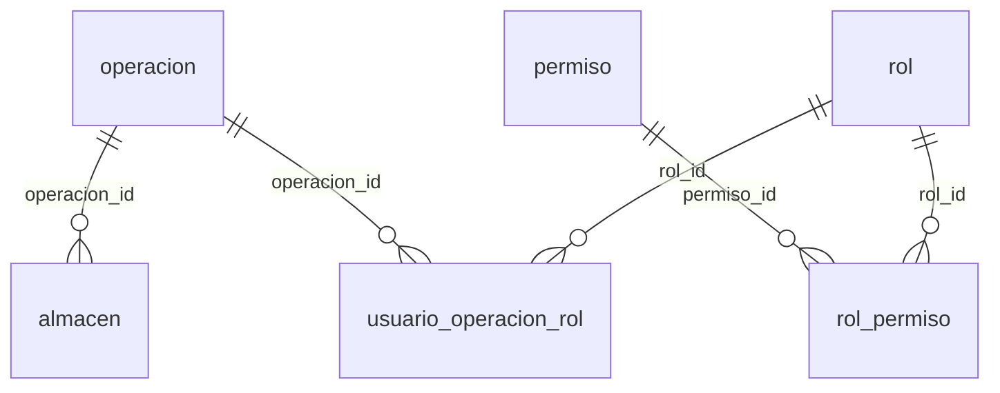
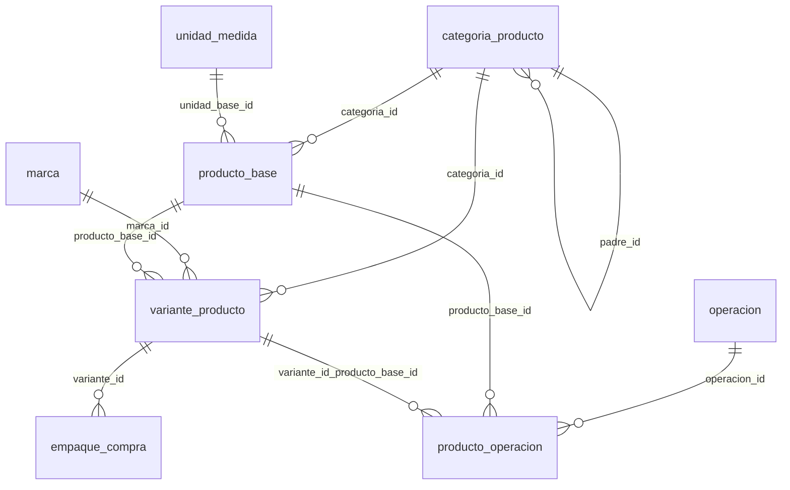
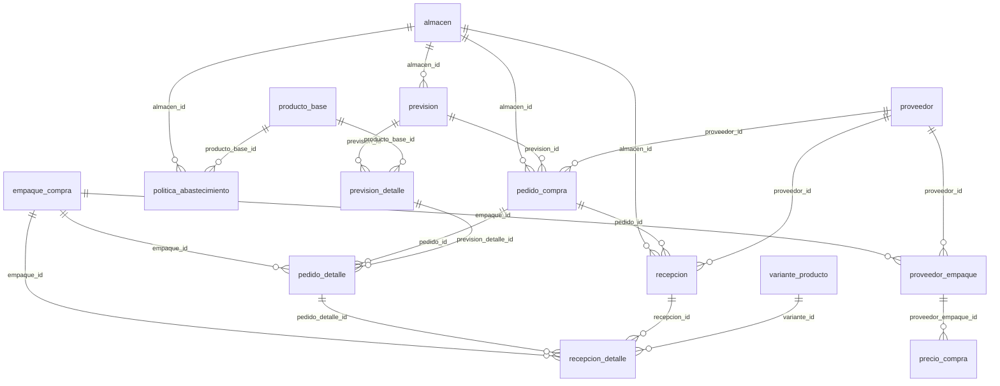
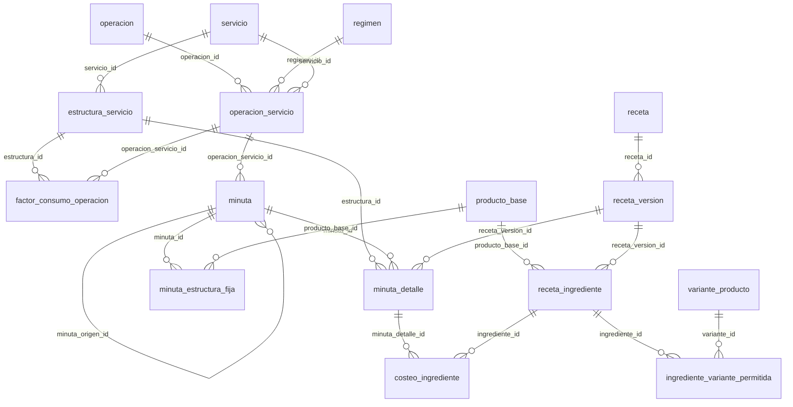
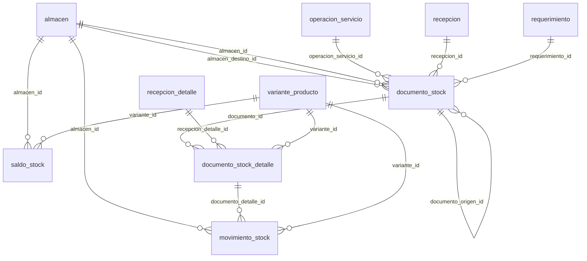
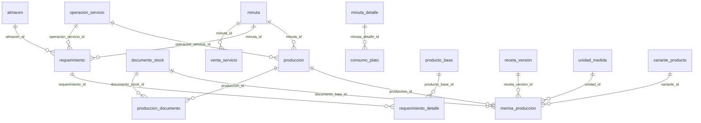
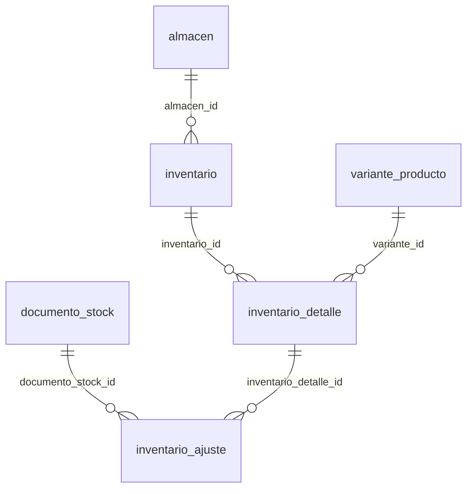
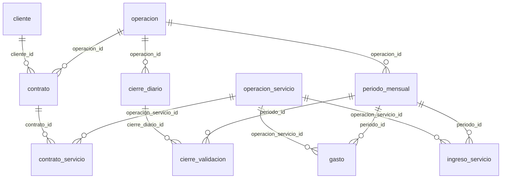
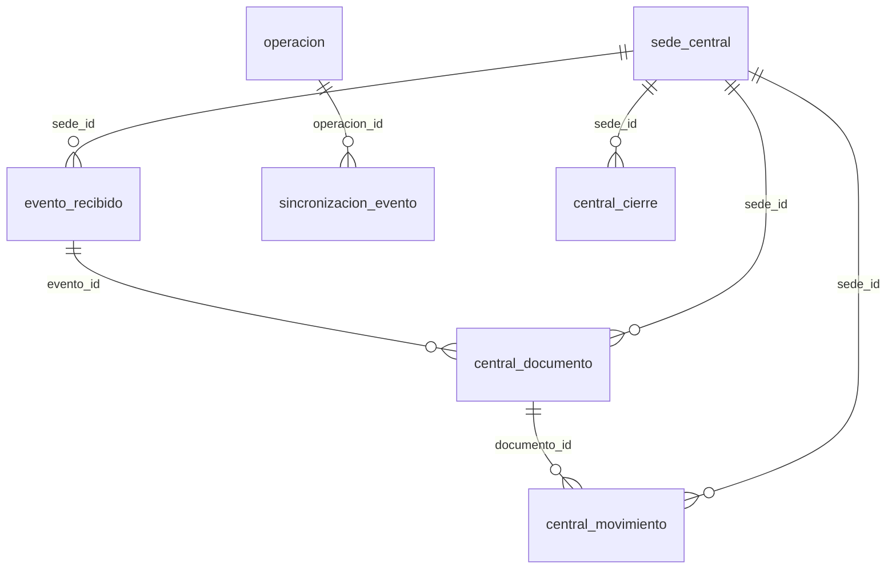

# Relaciones de la base de datos (llaves primarias y foráneas)

Actualizado: 2026-10-03 (migraciones V001–V019).

La base tiene 71 tablas: las 70 del esquema y `esquema_migracion`, que crea el migrador. Hay 203 llaves foráneas. Este documento se generó leyendo las restricciones directamente de PostgreSQL.

## Cómo leerlo

* **PK** es la llave primaria. Todas las tablas tienen `id` autonumérico.
* **Toda tabla con datos de una empresa** tiene `empresa_id → empresa.id`. Además, sus llaves foráneas incluyen `empresa_id`: por ejemplo, `(empresa_id, producto_base_id) → producto_base(empresa_id, id)`. Esto impide enlazar un registro con otro de otra empresa. En las tablas de abajo se escribe abreviado: `producto_base_id → producto_base.id (misma empresa)`.
* Las relaciones con `usuario` (quién creó, aprobó o contó) se listan, pero no se dibujan en los diagramas para no cargarlos.

## Resumen

| Área | Tablas | Relaciones principales |
|---|---|---|
| Acceso y seguridad | 9 | empresa → operación → almacén; usuario ↔ rol por operación; rol ↔ permiso |
| Catálogo | 7 | ingrediente (producto_base) → productos (variante_producto) → bulto (empaque_compra); categoría jerárquica; producto activo por operación |
| Proveedores y compras | 10 | proveedor ↔ bulto (proveedor_empaque) → precio; previsión → pedido → recepción |
| Recetas y menús | 13 | receta → versión → ingredientes; servicio + régimen → servicio de la operación → minuta → platos → costo de ingredientes |
| Almacén y kárdex | 4 | documento → líneas → movimiento (kárdex) y saldo por almacén y producto |
| Producción y real del servicio | 7 | minuta → requerimiento → entrega (documento); producción → mermas; consumo y venta real |
| Inventario físico | 3 | inventario por almacén → líneas por producto → ajuste (documento) |
| Cierres, contratos y resultados | 8 | cierre diario y periodo mensual; cliente → contrato → servicios; ingresos y gastos por periodo |
| Sincronización e integraciones | 9 | cola de salida (sincronizacion_evento) → central: sede → eventos → documentos y movimientos |

## Acceso y seguridad

| Tabla | PK | Llaves foráneas (columna → tabla.columna) | La referencian |
|---|---|---|---|
| `empresa` | `id` | — | todas las tablas de datos |
| `operacion` | `id` | `empresa_id` → `empresa.id` | `almacen`, `cierre_diario`, `contrato`, `operacion_servicio`, `periodo_mensual`, `producto_operacion`, `sincronizacion_evento`, `usuario_operacion_rol` |
| `almacen` | `id` | `empresa_id` → `empresa.id` `operacion_id` → `operacion.id` (misma empresa) | `documento_stock`, `inventario`, `movimiento_stock`, `pedido_compra`, `politica_abastecimiento`, `prevision`, `recepcion`, `requerimiento`, `saldo_stock` |
| `usuario` | `id` | `empresa_id` → `empresa.id` | `auditoria`, `cierre_diario`, `consumo_plato`, `documento_stock`, `factor_consumo_operacion`, `gasto`, `inventario`, `inventario_ajuste`, `inventario_detalle`, `minuta`, `movimiento_stock`, `pedido_compra`, `periodo_mensual`, `prevision`, `produccion`, `producto_operacion`, `recepcion`, `requerimiento`, `usuario_operacion_rol`, `venta_servicio` |
| `rol` | `id` | `empresa_id` → `empresa.id` | `rol_permiso`, `usuario_operacion_rol` |
| `permiso` | `id` | `empresa_id` → `empresa.id` | `rol_permiso` |
| `rol_permiso` | `id` | `empresa_id` → `empresa.id` `permiso_id` → `permiso.id` (misma empresa) `rol_id` → `rol.id` (misma empresa) |  |
| `usuario_operacion_rol` | `id` | `empresa_id` → `empresa.id` `operacion_id` → `operacion.id` (misma empresa) `rol_id` → `rol.id` (misma empresa) `usuario_id` → `usuario.id` (misma empresa) |  |
| `auditoria` | `id` | `empresa_id` → `empresa.id` `usuario_id` → `usuario.id` (misma empresa) |  |

## Catálogo

| Tabla | PK | Llaves foráneas (columna → tabla.columna) | La referencian |
|---|---|---|---|
| `unidad_medida` | `id` | `empresa_id` → `empresa.id` | `merma_produccion`, `producto_base` |
| `categoria_producto` | `id` | `empresa_id` → `empresa.id` `padre_id` → `categoria_producto.id` (misma empresa) | `producto_base`, `variante_producto` |
| `marca` | `id` | `empresa_id` → `empresa.id` | `variante_producto` |
| `producto_base` | `id` | `empresa_id` → `empresa.id` `categoria_id` → `categoria_producto.id` (misma empresa) `unidad_base_id` → `unidad_medida.id` (misma empresa) | `minuta_estructura_fija`, `politica_abastecimiento`, `prevision_detalle`, `producto_operacion`, `receta_ingrediente`, `requerimiento_detalle`, `variante_producto` |
| `variante_producto` | `id` | `empresa_id` → `empresa.id` `categoria_id` → `categoria_producto.id` (misma empresa) `marca_id` → `marca.id` (misma empresa) `producto_base_id` → `producto_base.id` (misma empresa) | `documento_stock_detalle`, `empaque_compra`, `ingrediente_variante_permitida`, `inventario_detalle`, `merma_produccion`, `movimiento_stock`, `producto_operacion`, `recepcion_detalle`, `saldo_stock` |
| `empaque_compra` | `id` | `empresa_id` → `empresa.id` `variante_id` → `variante_producto.id` (misma empresa) | `pedido_detalle`, `proveedor_empaque`, `recepcion_detalle` |
| `producto_operacion` | `id` | `empresa_id` → `empresa.id` `operacion_id` → `operacion.id` (misma empresa) `producto_base_id` → `producto_base.id` (misma empresa) `usuario_id` → `usuario.id` (misma empresa) `variante_id, producto_base_id` → `variante_producto.id, producto_base_id` (misma empresa) |  |

## Proveedores y compras

| Tabla | PK | Llaves foráneas (columna → tabla.columna) | La referencian |
|---|---|---|---|
| `proveedor` | `id` | `empresa_id` → `empresa.id` | `pedido_compra`, `proveedor_empaque`, `recepcion` |
| `proveedor_empaque` | `id` | `empresa_id` → `empresa.id` `empaque_id` → `empaque_compra.id` (misma empresa) `proveedor_id` → `proveedor.id` (misma empresa) | `precio_compra` |
| `precio_compra` | `id` | `empresa_id` → `empresa.id` `proveedor_empaque_id` → `proveedor_empaque.id` (misma empresa) |  |
| `politica_abastecimiento` | `id` | `empresa_id` → `empresa.id` `almacen_id` → `almacen.id` (misma empresa) `producto_base_id` → `producto_base.id` (misma empresa) |  |
| `prevision` | `id` | `empresa_id` → `empresa.id` `almacen_id` → `almacen.id` (misma empresa) `usuario_id` → `usuario.id` (misma empresa) | `pedido_compra`, `prevision_detalle` |
| `prevision_detalle` | `id` | `empresa_id` → `empresa.id` `prevision_id` → `prevision.id` (misma empresa) `producto_base_id` → `producto_base.id` (misma empresa) | `pedido_detalle` |
| `pedido_compra` | `id` | `empresa_id` → `empresa.id` `almacen_id` → `almacen.id` (misma empresa) `prevision_id` → `prevision.id` (misma empresa) `proveedor_id` → `proveedor.id` (misma empresa) `aprobador_id` → `usuario.id` (misma empresa) `usuario_id` → `usuario.id` (misma empresa) | `pedido_detalle`, `recepcion` |
| `pedido_detalle` | `id` | `empresa_id` → `empresa.id` `empaque_id` → `empaque_compra.id` (misma empresa) `pedido_id` → `pedido_compra.id` (misma empresa) `prevision_detalle_id` → `prevision_detalle.id` (misma empresa) | `recepcion_detalle` |
| `recepcion` | `id` | `empresa_id` → `empresa.id` `almacen_id` → `almacen.id` (misma empresa) `pedido_id` → `pedido_compra.id` (misma empresa) `proveedor_id` → `proveedor.id` (misma empresa) `usuario_id` → `usuario.id` (misma empresa) | `documento_stock`, `recepcion_detalle` |
| `recepcion_detalle` | `id` | `empresa_id` → `empresa.id` `empaque_id` → `empaque_compra.id` (misma empresa) `pedido_detalle_id` → `pedido_detalle.id` (misma empresa) `recepcion_id` → `recepcion.id` (misma empresa) `variante_id` → `variante_producto.id` (misma empresa) | `documento_stock_detalle` |

## Recetas y menús

| Tabla | PK | Llaves foráneas (columna → tabla.columna) | La referencian |
|---|---|---|---|
| `receta` | `id` | `empresa_id` → `empresa.id` | `receta_version` |
| `receta_version` | `id` | `empresa_id` → `empresa.id` `receta_id` → `receta.id` (misma empresa) | `merma_produccion`, `minuta_detalle`, `receta_ingrediente` |
| `receta_ingrediente` | `id` | `empresa_id` → `empresa.id` `producto_base_id` → `producto_base.id` (misma empresa) `receta_version_id` → `receta_version.id` (misma empresa) | `costeo_ingrediente`, `ingrediente_variante_permitida` |
| `ingrediente_variante_permitida` | `id` | `empresa_id` → `empresa.id` `ingrediente_id` → `receta_ingrediente.id` (misma empresa) `variante_id` → `variante_producto.id` (misma empresa) |  |
| `servicio` | `id` | `empresa_id` → `empresa.id` | `estructura_servicio`, `operacion_servicio` |
| `regimen` | `id` | `empresa_id` → `empresa.id` | `operacion_servicio` |
| `operacion_servicio` | `id` | `empresa_id` → `empresa.id` `operacion_id` → `operacion.id` (misma empresa) `regimen_id` → `regimen.id` (misma empresa) `servicio_id` → `servicio.id` (misma empresa) | `contrato_servicio`, `documento_stock`, `factor_consumo_operacion`, `gasto`, `ingreso_servicio`, `minuta`, `produccion`, `requerimiento` |
| `estructura_servicio` | `id` | `empresa_id` → `empresa.id` `servicio_id` → `servicio.id` (misma empresa) | `factor_consumo_operacion`, `minuta_detalle` |
| `factor_consumo_operacion` | `id` | `empresa_id` → `empresa.id` `estructura_id` → `estructura_servicio.id` (misma empresa) `operacion_servicio_id` → `operacion_servicio.id` (misma empresa) `usuario_id` → `usuario.id` (misma empresa) |  |
| `minuta` | `id` | `empresa_id` → `empresa.id` `minuta_origen_id` → `minuta.id` (misma empresa) `operacion_servicio_id` → `operacion_servicio.id` (misma empresa) `usuario_id` → `usuario.id` (misma empresa) | `minuta_detalle`, `minuta_estructura_fija`, `produccion`, `requerimiento`, `venta_servicio` |
| `minuta_detalle` | `id` | `empresa_id` → `empresa.id` `estructura_id` → `estructura_servicio.id` (misma empresa) `minuta_id` → `minuta.id` (misma empresa) `receta_version_id` → `receta_version.id` (misma empresa) | `consumo_plato`, `costeo_ingrediente` |
| `minuta_estructura_fija` | `id` | `empresa_id` → `empresa.id` `minuta_id` → `minuta.id` (misma empresa) `producto_base_id` → `producto_base.id` (misma empresa) |  |
| `costeo_ingrediente` | `id` | `empresa_id` → `empresa.id` `minuta_detalle_id` → `minuta_detalle.id` (misma empresa) `ingrediente_id` → `receta_ingrediente.id` (misma empresa) |  |

## Almacén y kárdex

| Tabla | PK | Llaves foráneas (columna → tabla.columna) | La referencian |
|---|---|---|---|
| `documento_stock` | `id` | `empresa_id` → `empresa.id` `almacen_destino_id` → `almacen.id` (misma empresa) `almacen_id` → `almacen.id` (misma empresa) `documento_origen_id` → `documento_stock.id` (misma empresa) `operacion_servicio_id` → `operacion_servicio.id` (misma empresa) `recepcion_id` → `recepcion.id` (misma empresa) `requerimiento_id` → `requerimiento.id` (misma empresa) `aprobador_id` → `usuario.id` (misma empresa) `usuario_id` → `usuario.id` (misma empresa) | `documento_stock_detalle`, `inventario_ajuste`, `merma_produccion`, `produccion_documento` |
| `documento_stock_detalle` | `id` | `empresa_id` → `empresa.id` `documento_id` → `documento_stock.id` (misma empresa) `recepcion_detalle_id` → `recepcion_detalle.id` (misma empresa) `variante_id` → `variante_producto.id` (misma empresa) | `movimiento_stock` |
| `movimiento_stock` | `id` | `empresa_id` → `empresa.id` `almacen_id` → `almacen.id` (misma empresa) `documento_detalle_id` → `documento_stock_detalle.id` (misma empresa) `usuario_id` → `usuario.id` (misma empresa) `variante_id` → `variante_producto.id` (misma empresa) |  |
| `saldo_stock` | `id` | `empresa_id` → `empresa.id` `almacen_id` → `almacen.id` (misma empresa) `variante_id` → `variante_producto.id` (misma empresa) |  |

## Producción y real del servicio

| Tabla | PK | Llaves foráneas (columna → tabla.columna) | La referencian |
|---|---|---|---|
| `requerimiento` | `id` | `empresa_id` → `empresa.id` `almacen_id` → `almacen.id` (misma empresa) `minuta_id` → `minuta.id` (misma empresa) `operacion_servicio_id` → `operacion_servicio.id` (misma empresa) `aprobador_id` → `usuario.id` (misma empresa) `usuario_id` → `usuario.id` (misma empresa) | `documento_stock`, `requerimiento_detalle` |
| `requerimiento_detalle` | `id` | `empresa_id` → `empresa.id` `producto_base_id` → `producto_base.id` (misma empresa) `requerimiento_id` → `requerimiento.id` (misma empresa) |  |
| `produccion` | `id` | `empresa_id` → `empresa.id` `minuta_id` → `minuta.id` (misma empresa) `operacion_servicio_id` → `operacion_servicio.id` (misma empresa) `usuario_id` → `usuario.id` (misma empresa) | `merma_produccion`, `produccion_documento` |
| `produccion_documento` | `id` | `empresa_id` → `empresa.id` `documento_stock_id` → `documento_stock.id` (misma empresa) `produccion_id` → `produccion.id` (misma empresa) |  |
| `merma_produccion` | `id` | `empresa_id` → `empresa.id` `documento_baja_id` → `documento_stock.id` (misma empresa) `produccion_id` → `produccion.id` (misma empresa) `receta_version_id` → `receta_version.id` (misma empresa) `unidad_id` → `unidad_medida.id` (misma empresa) `variante_id` → `variante_producto.id` (misma empresa) |  |
| `consumo_plato` | `id` | `empresa_id` → `empresa.id` `minuta_detalle_id` → `minuta_detalle.id` (misma empresa) `usuario_id` → `usuario.id` (misma empresa) |  |
| `venta_servicio` | `id` | `empresa_id` → `empresa.id` `minuta_id` → `minuta.id` (misma empresa) `usuario_id` → `usuario.id` (misma empresa) |  |

## Inventario físico

| Tabla | PK | Llaves foráneas (columna → tabla.columna) | La referencian |
|---|---|---|---|
| `inventario` | `id` | `empresa_id` → `empresa.id` `almacen_id` → `almacen.id` (misma empresa) `autorizador_id` → `usuario.id` (misma empresa) `revisor_id` → `usuario.id` (misma empresa) `usuario_id` → `usuario.id` (misma empresa) | `inventario_detalle` |
| `inventario_detalle` | `id` | `empresa_id` → `empresa.id` `inventario_id` → `inventario.id` (misma empresa) `contado_por` → `usuario.id` (misma empresa) `variante_id` → `variante_producto.id` (misma empresa) | `inventario_ajuste` |
| `inventario_ajuste` | `id` | `empresa_id` → `empresa.id` `documento_stock_id` → `documento_stock.id` (misma empresa) `inventario_detalle_id` → `inventario_detalle.id` (misma empresa) `autorizador_id` → `usuario.id` (misma empresa) |  |

## Cierres, contratos y resultados

| Tabla | PK | Llaves foráneas (columna → tabla.columna) | La referencian |
|---|---|---|---|
| `cierre_diario` | `id` | `empresa_id` → `empresa.id` `operacion_id` → `operacion.id` (misma empresa) `usuario_cierre_id` → `usuario.id` (misma empresa) | `cierre_validacion` |
| `cierre_validacion` | `id` | `empresa_id` → `empresa.id` `cierre_diario_id` → `cierre_diario.id` (misma empresa) `periodo_id` → `periodo_mensual.id` (misma empresa) |  |
| `periodo_mensual` | `id` | `empresa_id` → `empresa.id` `operacion_id` → `operacion.id` (misma empresa) `usuario_cierre_id` → `usuario.id` (misma empresa) | `cierre_validacion`, `gasto`, `ingreso_servicio` |
| `cliente` | `id` | `empresa_id` → `empresa.id` | `contrato` |
| `contrato` | `id` | `empresa_id` → `empresa.id` `cliente_id` → `cliente.id` (misma empresa) `operacion_id` → `operacion.id` (misma empresa) | `contrato_servicio` |
| `contrato_servicio` | `id` | `empresa_id` → `empresa.id` `contrato_id` → `contrato.id` (misma empresa) `operacion_servicio_id` → `operacion_servicio.id` (misma empresa) |  |
| `ingreso_servicio` | `id` | `empresa_id` → `empresa.id` `operacion_servicio_id` → `operacion_servicio.id` (misma empresa) `periodo_id` → `periodo_mensual.id` (misma empresa) |  |
| `gasto` | `id` | `empresa_id` → `empresa.id` `operacion_servicio_id` → `operacion_servicio.id` (misma empresa) `periodo_id` → `periodo_mensual.id` (misma empresa) `usuario_id` → `usuario.id` (misma empresa) |  |

## Sincronización e integraciones

| Tabla | PK | Llaves foráneas (columna → tabla.columna) | La referencian |
|---|---|---|---|
| `origen_sincronizacion` | `empresa_id` | `empresa_id` → `empresa.id` |  |
| `sincronizacion_evento` | `id` | `empresa_id` → `empresa.id` `operacion_id` → `operacion.id` (misma empresa) |  |
| `sede_central` | `id` | `empresa_id` → `empresa.id` | `central_cierre`, `central_documento`, `central_movimiento`, `evento_recibido` |
| `evento_recibido` | `id` | `empresa_id` → `empresa.id` `sede_id` → `sede_central.id` | `central_documento` |
| `rechazo_sincronizacion` | `id` | — |  |
| `central_documento` | `id` | `empresa_id` → `empresa.id` `evento_id` → `evento_recibido.id` `sede_id` → `sede_central.id` | `central_movimiento` |
| `central_movimiento` | `id` | `empresa_id` → `empresa.id` `documento_id` → `central_documento.id` `sede_id` → `sede_central.id` |  |
| `central_cierre` | `id` | `empresa_id` → `empresa.id` `sede_id` → `sede_central.id` |  |
| `integracion_envio` | `id` | `empresa_id` → `empresa.id` |  |
